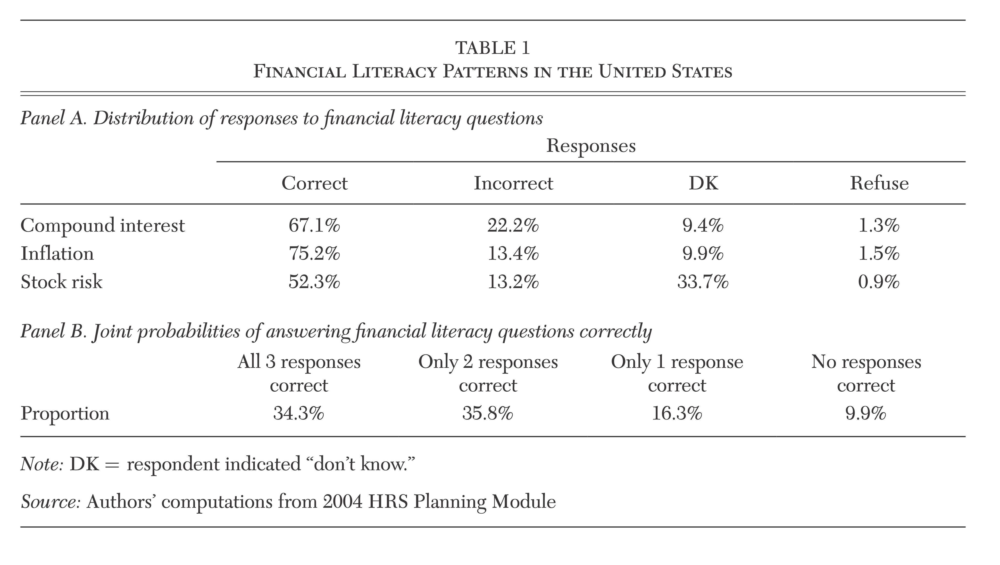
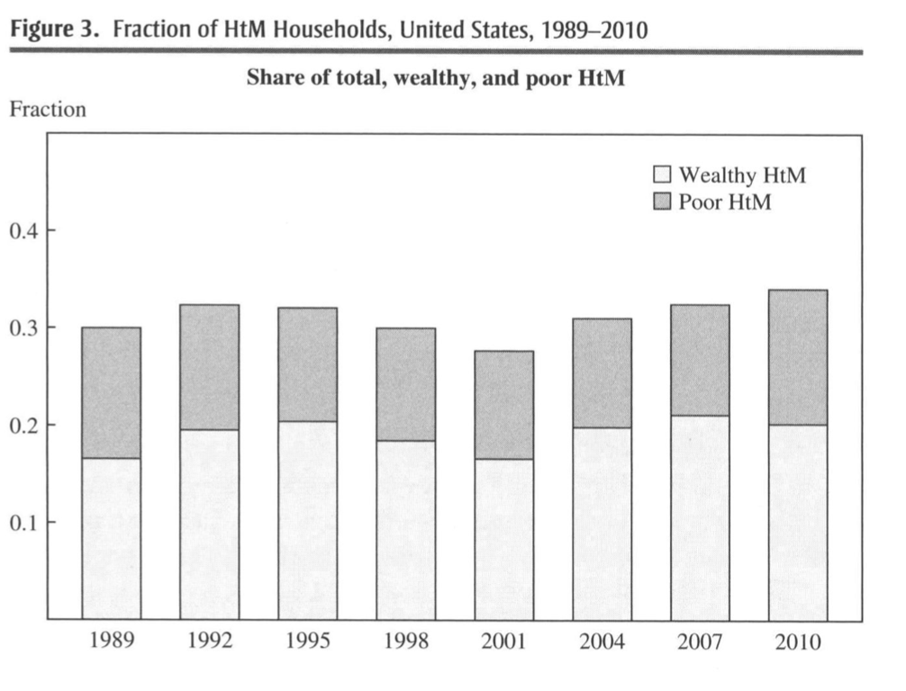
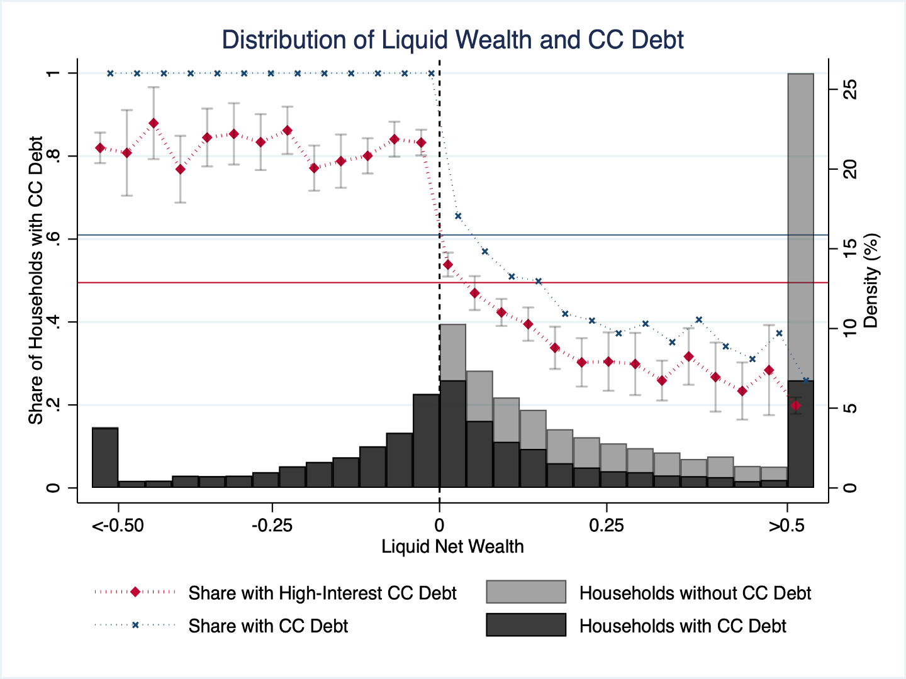

```{r setup, include=FALSE}

options(htmltools.dir.version = FALSE)
options("getSymbols.warning4.0"=FALSE)


library(here) # creates absolute paths, but those won't work in html
library(knitr)
library(kableExtra)
library(tidyverse)
library(wooldridge)
require(lubridate)
require(scales)
require(broom)
require(visualize)
library(mathjaxr)

require(wbstats)
require(lmtest)
require(sandwich)
require(car)
require(quantmod)
require(patchwork)


# https://yihui.org/knitr/options/
opts_chunk$set(
  fig.align="center",
  #dpi=300,
  fig.path='figs/', # where figs are rendered
  cache=F,
  echo=F,
  message = F,
  warning = F
  )

```

layout: true

<div class="msu-header"></div>
<div style = "position:fixed; visibility: hidden">
$$\require{color}\definecolor{yellow}{rgb}{1, 0.8, 0.16078431372549}$$
$$\require{color}\definecolor{orange}{rgb}{0.96078431372549, 0.525490196078431, 0.203921568627451}$$
$$\require{color}\definecolor{MSUgreen}{rgb}{0.0784313725490196, 0.52156862745098, 0.231372549019608}$$
</div>

<script type="text/x-mathjax-config">
MathJax.Hub.Config({
  TeX: {
    Macros: {
      yellow: ["{\\color{yellow}{#1}}", 1],
      orange: ["{\\color{orange}{#1}}", 1],
      MSUgreen: ["{\\color{MSUgreen}{#1}}", 1]
    },
    loader: {load: ['[tex]/color']},
    tex: {packages: {'[+]': ['color']}}
  }
});
</script>

<style>
.yellow {color: #FFCC29;}
.orange {color: #F58634;}
.MSUGreen {color: #14853B;}
</style>


```{r topdfs_colors, echo=FALSE}
library(flair)
yellow <- "#FFCC29"
orange <- "#F58634"
MSUGreen <- "#14853B"
source(here::here("Slides/pdfize.R"))
pdfize(here::here("Slides/01-DefaultEffects.html"))
```

```{r, load_refs, include=FALSE, cache=FALSE}
library(RefManageR)
BibOptions(check.entries = FALSE,
           bib.style = "authoryear",
           cite.style = "alphabetic",
           style = "markdown",
           hyperlink = FALSE,
           dashed = FALSE)
myBib <- ReadBib("./EC804.bib", check = FALSE)
```

---
class: inverseMSU
name: Overview
# Today

###  **Our Outline:**

(1) [The Standard Model](#section1)

(2) [401k Savings: Introduction](#section2)

(3) [Present Bias](#section3)

(4) [Facts About Household Finance](#section4)


---
class: MSU 
name: section1
# Choice over Time


**Exponential discounting:** When a person receives utility at different points in time, she seeks to maximize her *intertemporal utility*:

$$U \equiv u_{1}+\delta u_{2}+\delta ^{2}u_{3}+...+\delta ^{T-1}u_{T}$$

--

or put another way: 
$$= \sum_{t=1}^{T}\delta ^{t-1}u_{t}\text{.}$$
--

- $u_{t}$ is her **instantaneous utility** in period $t$ (or her "well-being" in period $t$).

--
	
- $\delta$ is her **discount factor**, where $\delta \in (0,1]$.

---
class: MSU 
name: section2
# 401k Savings


401(k) savings is the most common voluntary savings vehicle in the US. In brief:

- Purpose is to let people set aside money for retirement

- Free choice of contribution rate, and (mostly free choice) over asset allocation

- Generally large penalties for early withdrawal

- Employer sometimes pays matching contribution up to a threshold.
	
- Tax deferred: employee pays (typically lower) marginal tax rate during retirement

--

# Patterns of 401(k) Investment (Choi et al. 2005)

- Two thirds of employees believe that they are saving too little.
		
- A quarter of these intend to raise their savings in the next 2 months.

- Almost nobody follows through.
	
- Reported undersavers have low savings rates.
	
- (Similar patterns in other surveys)
		
---
class: MSU 
# Discussion Points

**Should** people save more? 

Can we trust self-reported desires / interests? 

- Consumption drops discretely at retirement, which might suggest under-saving
				
- But it's hard to show that people undersave [http://faculty.chicagobooth.edu/erik.hurst/research/retirement_consumption_survey_nber_final.pdf](Erik Hurst's work)
	
- Increased saving from automatic enrollment may come from more debt rather than from reduced consumption (Beshears et al. 2017)
	

---

class: MSU 
# Enter: The Real World

The nature of the conflict between selves is often seen in our daily activities. 

However, as PhD Economists, we are often looking for smoking guns in the domain where our expertise lies (economics). 

--

In the next mess of slides, I will make the argument that one domain worthy of lots of additional exploration is *household finance.* 

I'll present a series of facts, many of which I will argue stem from a conflict between selves. But this is a bold assertion and you should be skeptical and inquisitive. 

---
class: MSU 
section: section4
# Nine Facts About Household Finance

Households in the United States: 

1. Have low levels of financial literacy

2. Have very few liquid assets (live hand to mouth)

3. Have substantial illiquid wealth

4. Have a high marginal propensity to consume out of liquid wealth

5. Have a low marginal propensity to consume out of illiquid wealth

6. Choose suboptimal financial service products 

7. Barely change their behavior after financial education interventions

8. Have misaligned financial intentions and financial actions

9. Make financial choices that can be manipulated

---
class: MSU 
# Financial Literacy 

(This is one of the only times I'll discuss such things in this course.)

Assessing literacy often comes down to simple questions such as: 

> Suppose you had $100 in a savings account and the interest rate was 2% per year.  After 5 years, how much do you think you would have in the account if you left the money to grow?

>i) More than $102

>ii) Exactly $102

>iii) Less than $102

>iv) Don’t know 

>v) Refuse to answer


---
class: MSU 
# Financial Literacy 

> Imagine that the interest rate on your savings account was 1% per year and inflation was 2% per year.  After 1 year, would you be able to buy with the money in this account:”

>i) More than today 

>ii) Exactly the same

>iii) Less than today

>iv) Don't know 

>v) Refuse to answer


---
class: MSU 
# Financial Literacy 

> Do you think the following statement is true or false? Buying a single company stock usually provides a safer return than a stock mutual fund.

>i) True

>ii) False

>iii) Don't know 

>iv) Refuse to answer


---
class: MSU 
# Financial Literacy: Data

Data from Lusardi and Mitchell (2014)

```{r, out.width = "800px"}

```


---
class: MSU 
# Hand-to-Mouth Living

### A Fact

Forty-six percent of U.S. adults report that they either could not come up with $400 to cover an emergency expense, or would have to borrow or sell something to do so. (Board of Governors of the Federal Reserve System, 2016).

--

### Another Fact

Most of these households are not negative net worth. 

---
class: MSU 
# "Wealthy" Hand-to-Mouth

Data from Kaplan, Violante, and Weidner (2014)

```{r, out.width = "500px"}

```


---
class: MSU 
# "Wealthy" Hand-to-Mouth

Data from Laibson, Lee, Maxted, Repetto, Tobacman (2022)
*(Composite of 2013, 2016, 2019 surveys)*

```{r, out.width = "700px"}

```

---
class: MSU 
# Liquidity and Consumption 

- Shapiro (2005): People on food stamps exhibit a monthly caloric cycle wherein calories drop 10-15% over the month

--

- Parker (2014): Nielsen data around 2008 Economic Stimulus Payments suggests a within-year MPX of 60%

--

- Ganong and Noel (2016): when unemployment insurance runs out (a predictable event), household consumption drops by 11%.

--

- Fagereng, Holm, and Natvik (2020): "Low-liquidity winners of the smallest prizes (around $1500) are estimated to spend all within the year of winning. The corresponding estimate for high-liquidity winners of large prizes ($8300-150K) is slightly below one half."

--

- Gerard and Naritomi (2021): “Displaced workers eligible for both UI and SP increase consumption at layoff by 35% despite experiencing a 17% consumption loss after they stop receiving any benefits”

--

*Also see Shea (1995), Mastrobuoni and Weinberg (2009), Hastings and Washington (2010), Olafsson and Pagel (2018), Stephens and Toohey (2018)*


---

class: MSU 
# Present-Biased Preferences

The **quasi-hyperbolic discount function** (Phelps and Pollak 1968, Laibson 1997, O'Donoghue and Rabin 1999):

$$D(\tau) = \begin{cases}
1 & \text{ if } \tau = 0 \\
\beta \cdot \delta^{\tau} & \text{ if } \tau \in \{1, 2, \ldots\}
\end{cases}$$

where $\beta \leq 1$

--

- We can then write the utility function as:

$$U^{t} = u_{t} + \beta \sum_{\tau = 1}^{T-t} \delta^{\tau} u_{t+\tau}$$


---
class: MSU 
# Present-Biased Preferences

### Intuitive Example 

(*Courtesy of Matthew Rabin*) Suppose there is a task that you must complete on one of the next four days.

To complete this task, you incur costs as follows: 

- If you complete the task in period 1, the cost is 3.

- If you complete the task in period 2, the cost is 5. 

- If you complete the task in period 3, the cost is 8.

- If you complete the task in period 4, the cost is 13.

--

Suppose there is no reward, that you value costs linearly, and that you have $\beta =1/2$ and $\delta =1$.

