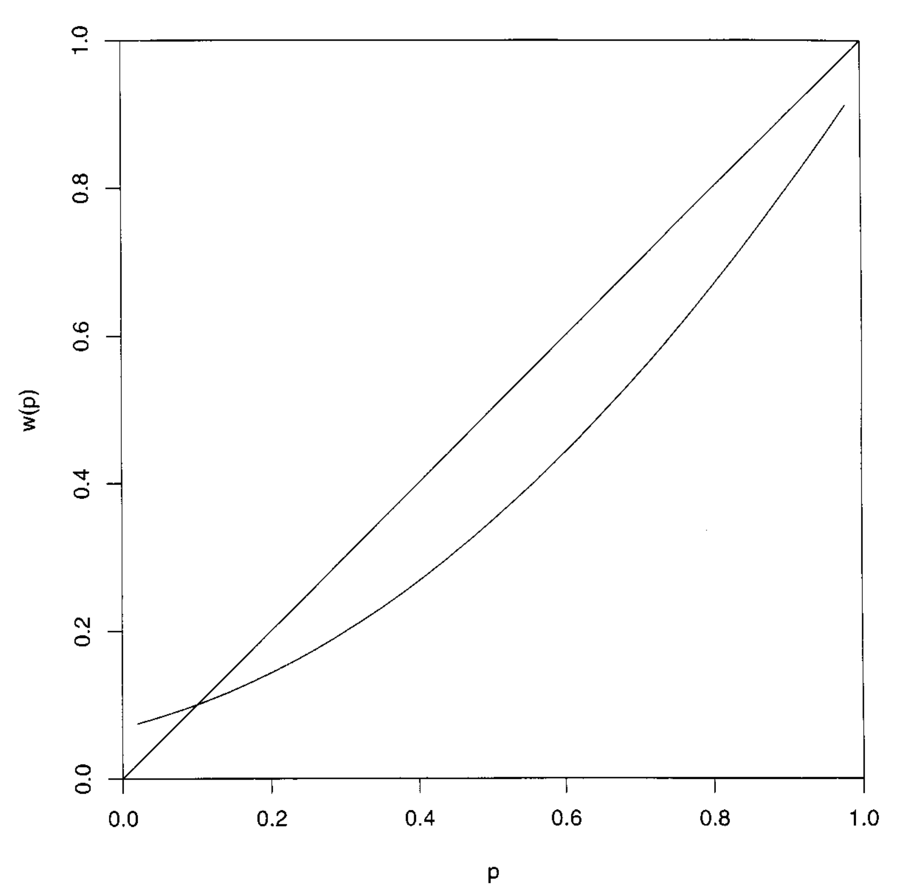
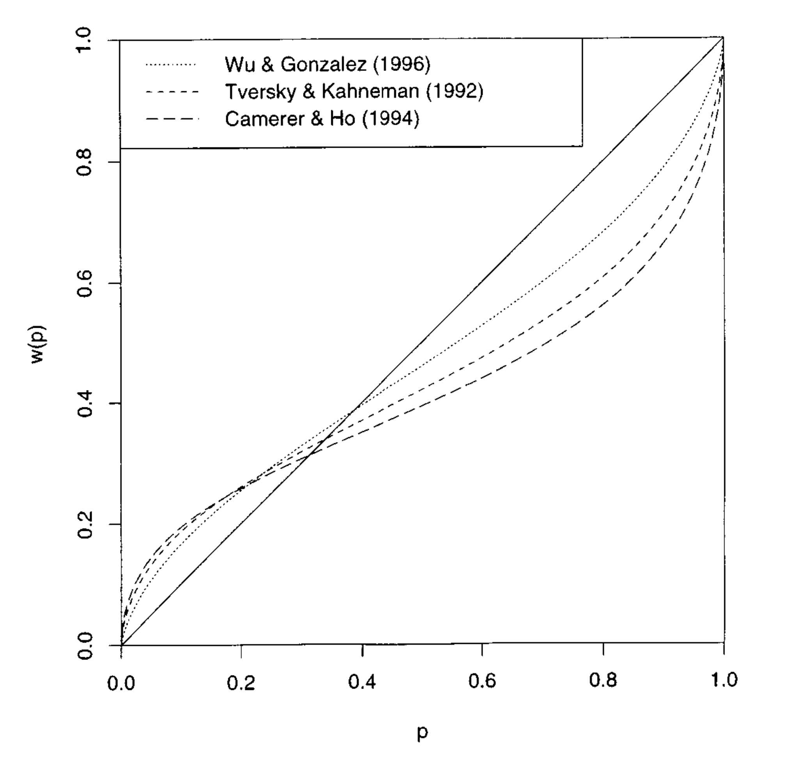
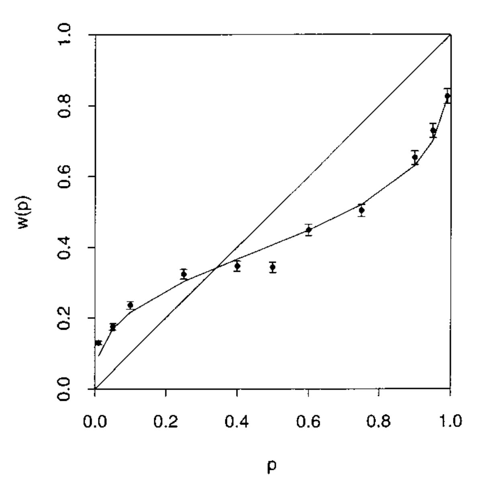

```{r setup, include=FALSE}

options(htmltools.dir.version = FALSE)
options("getSymbols.warning4.0"=FALSE)


library(here) # creates absolute paths, but those won't work in html
library(knitr)
library(kableExtra)
library(tidyverse)
library(wooldridge)
require(lubridate)
require(scales)
require(broom)
require(visualize)

require(wbstats)
require(lmtest)
require(sandwich)
require(car)
require(quantmod)
require(patchwork)


# https://yihui.org/knitr/options/
opts_chunk$set(
  fig.align="center",
  #dpi=300,
  fig.path='figs/', # where figs are rendered
  cache=F,
  echo=F,
  message = F,
  warning = F
  )

```

layout: true

<div class="msu-header"></div>
<div style = "position:fixed; visibility: hidden">
$$\require{color}\definecolor{yellow}{rgb}{1, 0.8, 0.16078431372549}$$
$$\require{color}\definecolor{orange}{rgb}{0.96078431372549, 0.525490196078431, 0.203921568627451}$$
$$\require{color}\definecolor{MSUgreen}{rgb}{0.0784313725490196, 0.52156862745098, 0.231372549019608}$$
</div>

<script type="text/x-mathjax-config">
MathJax.Hub.Config({
  TeX: {
    Macros: {
      yellow: ["{\\color{yellow}{#1}}", 1],
      orange: ["{\\color{orange}{#1}}", 1],
      MSUgreen: ["{\\color{MSUgreen}{#1}}", 1]
    },
    loader: {load: ['[tex]/color']},
    tex: {packages: {'[+]': ['color']}}
  }
});
</script>

<style>
.yellow {color: #FFCC29;}
.orange {color: #F58634;}
.MSUGreen {color: #14853B;}
</style>


```{r flair_color, echo=FALSE}
library(flair)
yellow <- "#FFCC29"
orange <- "#F58634"
MSUGreen <- "#14853B"
```


```{r, eval=FALSE}

#BELOW IS WHERE YOU ADD CONTENT. KEEP ABOVE CONSTAN EXCEPT TITLE.

```

---

class: inverseMSU
name: Overview

# Today

###  **Our Outline:**


(1) [Guiding Principles](#Guide)

(2) [Introduction to Reference Dependence](#section1)

(3) [A New Model: Prospect Theory](#section2)

(4) [Loss Aversion](#section3)

(5) [Diminishing Sensitivity](#section4)

(6) [The Value Function](#section5)

---

class: inverseMSU
name: Guide

# Guiding Principle

## \#2: Use Extreme Cases to Clarify Your Thinking

--

Some concepts are hard to get your head around. It can be easier to think about things in the extreme limit.

--

- E.g., "risk aversion" will continue to trip you up throughout this section.
- Think about the limit case: a person who is **infinitely** risk averse.
- Now think about the other limit case: a person who is risk neutral.
- In between those lies reality. The **definition** of the term only offers that a person is a teensy tiny itty bitty bit above risk neutrality. How she actually behaves depends on *how* risk averse she is.

--

**Your task:** think about limit cases.


---

class: MSU
# Contrasts Matter

**Moe:** " If you want to signal me, use this bird call."

*[Moe whistles like a bird. An eagle swoops down and pecks him on the face.]*

--

$\quad \quad$ "Ow! Not the face!"

*[The eagle switches to pecking Moe in the groin.]*

--

$\quad \quad$ "Ooh! Ooh! Okay, the face!

*[The eagle switches back.]*

--

$\quad \quad$ "Ooh! Whoa, that actually feels good after the crotch!"

---
class: MSU
name: section1
# Reference-Dependent Feelings

### A Simple Truth

In virtually all physiological and psychological reactions, people's responses tend to reflect adaptation, change, and contrast, rather than solely absolute levels of outcomes.

--

- Feelings (and, just as importantly, choice) are reference-dependent.

- This suggests a modifictation to the models that we use.

> We should consider a modified utility function $u(x;r)$ rather than $u(w+x),$ where $r$ is some reference point or reference level.

--

We'll explore this idea for the next few lectures. There are deep implications for economics in this simple observation.


---
class: MSU
name: section2

# Prospect Theory


Amos Tversky and Daniel Kahneman worked on this in the 1970s. Kahneman won the Nobel Prize in Economics for their joint work in 2002.

---
class: MSU
# Prospect Theory

Propect Theory proposes two phases of choice process:

1. Editing

2. Evaluation

--

We begin our discussion with the former, but our focus today will be on the latter.

---
class: MSU
# Prospect Theory: Editing Stage

## Editing Stage

The psychology of the editing stage is straightforward: a person needs to organize & reformulate some complex situation into a simplified problem.

- More concretely: a choice problem is described to you, and then you transform it into the lotteries that you will evaluate.

--

### Some Examples:

- **Coding:** code outcomes as gains (or losses) relative to some reference point.
- **Cancellation:** discard shared components.
- **Simplification:** rounding off probabilities.
- Eliminating dominated alternatives.

--

This is an example of the type of thing we won't spend a lot of time on in this course, but it was important to early pioneers.

---
class: MSU
# Prospect Theory: Evaluation Stage

### Evaluation in a Nutshell

Of course, once we face a decision problem we must evaluate it.

Kahneman and Tversky (1979, p. 277) stress that attending to changes from reference points is a basic aspect of human nature:

> Our perceptual apparatus is attuned to the evaluation of changes or differences rather than to the evaluation of absolute magnitudes ... The same principle applies to non-sensory attributes such as health, prestige, and wealth.

--

The two key features of evaluation emphasized by Kahneman and Tversky (1979) and subsequently by many others:

1. Loss Aversion
2. Diminishing Sensitivity


---
class: MSU
name: section3

# Prospect Theory: Loss Aversion

### Loss Aversion: A "Definition"

(Note: this is one of the few times where you can just rely on your intuitive response to the terms. It means exactly what you think it means.)

--

**People dislike losses more than they like same-sized gains.**

--

- Vast majority of people turn down 50/50 lose $500, gain $550 bet

- As highlighted last time, this is *not* due to curvature in utility function.

- Not discussed last time: the strongest such aversion appears to involve mixes of gains and losses.

---

class: MSU

# Prospect Theory: Loss Aversion

Loss aversion is an absolutely central component of prospect theory.

It's existence or importance remains a source of scholarly debate.

> Note that I say scholarly. I suspect the average person would immediately agree with the assertion that losses > gains.

--

### My View of Loss Aversion

It is central in a number of everyday activities:

- Moral considerations (e.g., Hippocratic Oath)
- "Endowment Effect" or "Status Quo Bias" in financial trades
- "Disposition Effects", in investments and houses
- Aversion to (nominal) wage and consumption declines
- Income-targeting

---

class: MSU
name: section4

# Prospect Theory: Diminishing Sensitivity

### Diminishing Sensitivity: A "Definition"

In the following pairs, which "feel" like a bigger difference?

| Option A | Option B |
|:---------|---------:|
| visually 101 ft. away vs. 100 ft. away|  1 ft. v. 0 ft. |
| carrying a suitcase 21 v. 20 blocks | 2  v. 1 block |
| gain 100 days from now v. 101 days | gain 0 days v. 1 day |
| 19% chance v. 18% chance | 1% chance v. 0% |
| gaining $101 v. gaining $100 | gaining $1 v. gaining $0 |
| losing $101 v. losing $100 | losing $1 v. losing $0 |
| losing $101 v. losing $100 | losing $2 v. losing $1 |


---

class: MSU
# Prospect Theory: Diminishing Sensitivity

### Diminishing Sensitivity: A Better "Definition"

People pay less attention to incremental differences when changes are further away from the reference point.

--

- Prefer $420 for sure or 50/50 chance at $900?

- Prefer losing $420 for sure or 50/50 chance to lose $900?

--

Reflects big and general fact about human psychology:

**We most often think in terms of proportions rather than absolutes.**

---
class: MSU
# Prospect Theory: Evaluation Stage

A person evaluates a prospect $\left( x,p;y,q\right)$ according to:

$$V\left( x,p;y,q\right) \quad =\quad \pi \left( p\right) v\left( x\right)+ \pi \left( q\right) v\left( y\right)$$

--

Reminder: EU theory says evaluate according to:

$$U\left( x,p;y,q\right) =pu\left( w+x\right) +qu\left( w+y\right) +\left(1-p-q\right) u\left( w\right)$$

--

### What's new?

$\pi\left(\cdot\right)$ is the **probability-weighting function**.

$v\left( \cdot \right)$ is the **value function**.

---
class: MSU

# Prospect Theory: Evaluation Stage

Put in a different notation, a person evaluates a prospect $\left( x_1,p_1;\dots; x_n,p_n\right)$ according to:

$$V\left( x_1,p_1;\dots; x_n,p_n\right) \quad =\sum_{i=1}^N \pi \left( p_i\right) v\left( x_i\right).$$

--

Contrast this with the Expected Utility definition

$$EU\left( x_1,p_1;\dots; x_n,p_n\right) = \sum_{i=1}^N p_i u\left( x_i\right)$$

--

and that of Expected Value

$$EV\left( x_1,p_1;\dots; x_n,p_n\right) = \sum_{i=1}^N p_i  x_i$$


---
class: MSU
# Prospect Theory: Value Function

### Breaking Down the Components of the Theory

Three key features of the value function $v\left( \cdot \right)$:

(1) The carriers of value are **changes** in wealth. Thus: $v\left( 0\right) =0$.

--
- Thus: $v\left( 0\right) =0$.
- Implicit in this assumption is that the reference point is current wealth.
- There are lots of examples where this is a bad assumption.

--

(2) *Diminishing sensitivity* to the magnitude of changes.

- Formally: $v'(x)>0$ for all $x$, and $v^{\prime\prime}\left(x\right)<0$ for $x>0$, while $v^{\prime \prime }\left(x\right) >0$ for $x<0$.

--

(3) *Loss aversion*, or losses loom larger than gains.

- Sloppy formality: $v(x)<v(-x)$ for all $x>0$.
- Formally: $v(x)+ v(-x) < v(y) + v(-y)$ for all $x>y$.


---
class: MSU 
# Prospect Theory: Value Function

These assumptions lead to the following visual form of the value function:

(see board; or just google it if you're not in class.)


--

A functional form that's often used:


$$v(x)=\{ x^{\alpha}\quad \text{ if }\quad x\geq 0$$
$$\quad \quad \quad \lambda (x)^{\beta}\quad \text{if }\quad x\leq 0$$

An even easier functional form that we will mostly use eliminates the exponents.

**Note:** This second functional form removes diminishing sensitivity and isolates the effect of loss aversion on decision-making. In lots of settings this will greatly simplify the problem while leaving the fun stuff intact.


---
class: MSU
# Implications (and non-Implications) 

If a person maximizes her preferences meeting the assumptions above, she...


--

(i) ...will turn down any 50/50 lose $X, gain $X bets.

-Implication (i) is implied by Loss Aversion.

- Non-Implication (i). "...is necessarily averse to all fair bets." 

- The assumptions do *not* guarantee a person will turn down all fair bets.

--

(ii) ...is risk averse among bets involving only gains.

- Implication 2 is implied directly by Diminishing Sensitivity.

--

(iii)... is risk-*loving* among bets involving only losses.

Implication (iii) is also implied directly by Diminishing Sensitivity.

---
class: MSU
# Implications (and non-Implications) 

(iv) ... is " first-order risk-averse."

- Implication (iv) requires important additional assumption.

---
class: inverseMSU
# An Aside

Let $x$ be a **random variable** with distribution $F(x)$.

Let $\mathbb{E}(x)$ denote the expectation of $x$ and $\sigma^2_x$ the variance.

Consider the lottery $k + x$ as the lottery that pays $k$ plus the realization of the random variable $x$.

**Claim:** Let $\mathbb{E}(x) = 0$ and consider an expected utility maximizer. 
Suppose $t >0$ such that $-\pi \sim t\cdot x + k$.  Then 

$$\pi \approx \frac{-t^2\sigma^2_x }{2}~ \frac{u''(w+k)}{u'(w+k)}$$
--

Put another way: the "risk premium" decreases at rate $t^2$, while the "size" of the risk decreases at rate $t$.


---
class: inverseMSU 
# First-Order Risk Aversion

Thus for small risks, a person must be almost *risk neutral*: the "premium" required to take on that risk would go to zero as the size of the risk goes to zero.

--
**Assumption:** A decision maker is *first-order risk averse* if for prospect theory value function $v(\cdot)$:

$$\lim_{x\to 0} \frac{v'(-x)}{v'(x)} \equiv L > 1$$ 

when approached from the $x>0$ direction.

--

We will carry this assumption through many of our functional forms.

---
class: MSU 
# Prospect Theory: Probability-Weighting Function

Recall: 
$$\quad V\left( x,p;y,q\right) \quad =\quad \pi \left( p\right) v\left( x\right)\quad +\quad \pi \left( q\right) v\left( y\right)$$

We turn to key features of the probability-weighting function $\pi \left( \cdot\right)$:

[EU theory says $\pi \left( p\right) =p$.]

--

Natural assumptions: 

- $\pi \left( 0\right) =0$, $\pi \left( 1\right) =1$, and $\pi$ is increasing.

- Subcertainty: $\pi \left( p\right) +\pi \left( 1-p\right)<1.$

- Subproportionality: 
$$\frac{\pi ( pq)}{\pi( p)} \leq \frac{\pi (pqr)}{\pi ( pr)}$$ 
for $p,q,r\in \left(0,1\right)$.

- For small $p$, $\pi \left( p\right) >p.$

---
class: MSU
# Probability-Weighting Function

```{r, out.width = "800px"}

```


---
class: MSU
# Probability-Weighting Function

```{r, out.width = "800px"}

```

---
class: MSU
# Probability-Weighting Function

```{r, out.width = "800px"}

```
