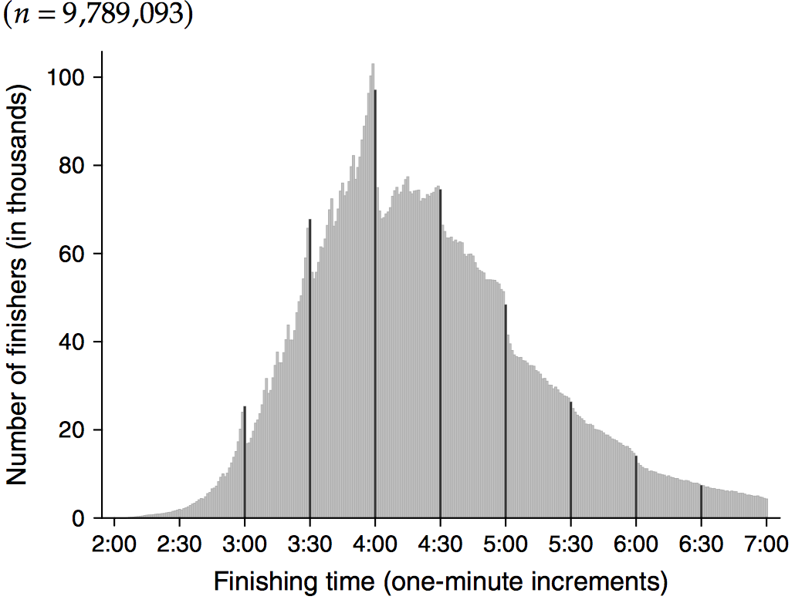
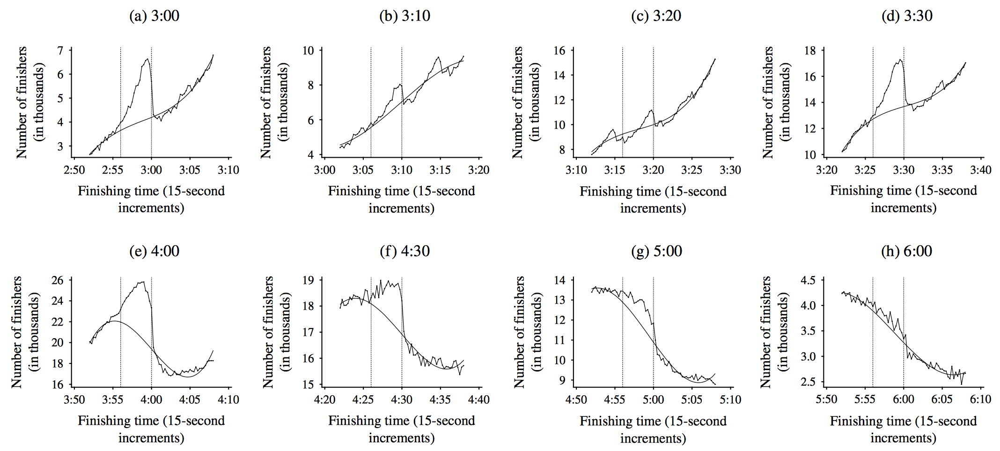

```{r setup, include=FALSE}

options(htmltools.dir.version = FALSE)
options("getSymbols.warning4.0"=FALSE)


library(here) # creates absolute paths, but those won't work in html
library(knitr)
library(kableExtra)
library(tidyverse)
library(wooldridge)
require(lubridate)
require(scales)
require(broom)
require(visualize)

require(wbstats)
require(lmtest)
require(sandwich)
require(car)
require(quantmod)
require(patchwork)


# https://yihui.org/knitr/options/
opts_chunk$set(
  fig.align="center",
  #dpi=300,
  fig.path='figs/', # where figs are rendered
  cache=F,
  echo=F,
  message = F,
  warning = F
  )

```

layout: true

<div class="msu-header"></div>
<div style = "position:fixed; visibility: hidden">
$$\require{color}\definecolor{yellow}{rgb}{1, 0.8, 0.16078431372549}$$
$$\require{color}\definecolor{orange}{rgb}{0.96078431372549, 0.525490196078431, 0.203921568627451}$$
$$\require{color}\definecolor{MSUgreen}{rgb}{0.0784313725490196, 0.52156862745098, 0.231372549019608}$$
</div>

<script type="text/x-mathjax-config">
MathJax.Hub.Config({
  TeX: {
    Macros: {
      yellow: ["{\\color{yellow}{#1}}", 1],
      orange: ["{\\color{orange}{#1}}", 1],
      MSUgreen: ["{\\color{MSUgreen}{#1}}", 1]
    },
    loader: {load: ['[tex]/color']},
    tex: {packages: {'[+]': ['color']}}
  }
});
</script>

<style>
.yellow {color: #FFCC29;}
.orange {color: #F58634;}
.MSUGreen {color: #14853B;}
</style>


```{r flair_color, echo=FALSE}
library(flair)
yellow <- "#FFCC29"
orange <- "#F58634"
MSUGreen <- "#14853B"
```


```{r, eval=FALSE}

#BELOW IS WHERE YOU ADD CONTENT. KEEP ABOVE CONSTANT EXCEPT TITLE.

```

---


class: inverseMSU
name: Overview

# Today

###  **Our Outline:**

(1) [Introduction to Modern Prospect Theory](#intro)

(2) [Köszegi and Rabin's Model with Two Goods](#sec1)

(3) [A (Not Easy) Exercise](#example)

(4) [Köszegi and Rabin's Model with Risky Choice](#sec2)

(5) [Application: Labor Supply of Taxicab Drivers](#app1)

(6) [Application: Detecting Loss Aversion with Bunching](#app2)

(7) [Concluding Thoughts](#conclusion) 


---
class: MSU
name: intro
# "Reinventing" Prospect Theory

In the next (two? one and a half?) lectures we will "discover" some problems with vanilla Prospect Theory.

--

We'll also introduce a bunch of "new" value functions.

$\dots$ except the value functions aren't new

$\dots$ and the discoveries were lurking in the back of your mind this whole time.

--

And we'll do a million exercises. This material is tricky.

---
class: MSU
# Köszegi & Rabin (2006)

We'll follow the KR theory of reference-dependent utility with loss aversion.  (Except it's really just the **right** way to do Prospect Theory.)

Their innovations address two major issues ("loopholes"):

1. What determines the reference point?

2. When do people experience loss aversion, and what is the magnitude of this experience?

--

They address these issues by incorporating two novel features:

A person's reference point is her recent beliefs or expectations about outcomes.

Gain-loss utility is directly tied to the intrinsic utility from consumption --- so that a person experiences more gain-loss utility for goods that involve more consumption utility.

---
class: MSU
name: sec1
# Köszegi & Rabin (2006)

### Model

Suppose there are $2$ goods:

- Person chooses a vector $(x_{A},x_{B})$.
- Reference point is a vector $(r_{A},r_{B})$.

--

**Preferences:**

$$\text{Total Utility } \equiv \text{ }\left[ \text{ }m_{A}(x_{A})\text{ }+ \text{ }n_{A}(x_{A}|r_{A})\text{ }\right]$$
$$\qquad \qquad \qquad \qquad  +\text{ }\left[ \text{ }m_{B}(x_{B})\text{ }+\text{ }n_{B}(x_{B}|r_{B})\text{ }\right]$$

--

- $m_{A}(x_{A})$ is intrinsic utility for good $A$, and $m_{B}(x_{B})$ is intrinsic utility for good $B$.

- $n_{A}(x_{A}|r_{A})$ is gain-loss utility for good $A$, and $n_{B}(x_{B}|r_{B})$ is gain-loss utility for good $B$.


---
class: MSU
# Köszegi & Rabin (2006)

How to formalize that gain-loss utility is directly tied to intrinsic utility:

Assume there exists a *universal gain-loss function* $\mu (z)$ such that the gain-loss utilities are:

$$v_{A}(x_{A}|r_{A}) =\mu \left( \text{ }m_{A}(x_{A})-m_{A}(r_{A})\text{ }\right)$$

$$v_{B}(x_{B}|r_{B}) =\mu \left( \text{ }m_{B}(x_{B})-m_{B}(r_{B})\text{ }\right)$$

--

In general, $\mu (z)$ takes form of the Kahneman-Tversky value function. But we'll focus on the "easy" case:

$$\mu (z)=\{ \quad  \eta*z \quad  \text{if} \quad z \geq 0$$
$$\qquad \qquad \eta*\lambda*z \quad \text{if} \quad z\leq 0$$


---
class: MSU
# Köszegi & Rabin (2006)

Example: Two goods, shoes ( $c$ ) and money ( $w$ ), with intrinsic utilities:

$$m(c) = \theta * c$$
$$m(w) = w$$

--

As with mugs, we can represent shoe utility in a 2x2 grid (see board)

---
class: MSU
# Köszegi & Rabin (2006)

Consider the following choice problem:

- Suppose Bogi starts with 0 shoes and wealth $w$, and has the option to purchase a shoe for price $p$. How does Bogi behave as a function of expectations?

**Case 1:** Suppose you expect to buy a pair of shoes
$\Longrightarrow$ reference point is $(r_{c}=1,r_{m}=w-p)$ :

$$\text{Utility(Buy)} = \left[ \theta +\eta 0\right] + \left[ (w-p)+\eta 0\right]$$

$$\text{Utility(Not)} = \left[ 0-\eta \lambda \theta \right] + \left[w+\eta p\right]$$

--

$$\text{Buy when Utility(Buy)} \geq \text{ Utility(Not)}\Longleftrightarrow p\leq \frac{1+\eta \lambda }{1+\eta }\theta$$


---
class: MSU
# Köszegi & Rabin (2006)

Consider the following choice problem:

- Suppose Bogi starts with 0 shoes and wealth $w$, and has the option to purchase a shoe for price $p$. How does Bogi behave as a function of expectations?

**Case 2:** Suppose you expect not to buy any shoes $\Longrightarrow$ reference point is $(r_{c}=0,r_{m}=w)$ :

$$\text{Utility(Buy)} = \left[ \theta +\eta \theta \right] + \left[ (w-p)-\eta \lambda p\right]$$

$$\text{Utility(Not)} = \left[ 0+\eta 0\right] + \left[ w+\eta 0 \right]$$


$$\text{Buy when Utility(Buy)}\geq \text{ Utility(Not)}\Longleftrightarrow p\leq \frac{1+\eta }{1+\eta \lambda }\theta$$.

---
class: MSU
# Köszegi & Rabin (2006)

Because $\lambda >1$ implies $\frac{1+\eta \lambda }{1+\eta }>\frac{1+\eta }{1+\eta \lambda}$, there are three cases:


1. If $p>\frac{1+\eta \lambda }{1+\eta }\theta$, don't buy no matter your beliefs.

--

2. If $p<\frac{1+\eta }{1+\eta \lambda }\theta$, buy no matter your beliefs.

--

3. If $\frac{1+\eta }{1+\eta \lambda }\theta <p<\frac{1+\eta \lambda }{1+\eta }\theta$, buy if you expect to buy, and don't buy if you expect not to buy.

**Point:** If the reference point depends on expectations, then, even in the same situation, a person might exhibit different outcomes depending on which set of self-fulfilling expectations he happens to have.

---
class: inverseMSU
name: exercise
# An Exercise

Suppose there are two goods, candy bars ($c$) and money ($m$). Paige has initial income $I$, and she is deciding whether to buy 0, 1, or 2 candy bars at a price of $p$ per candy bar. Paige's total utility is the sum of her candy-bar utility and her money utility, and her intrinsic utilities for the two goods are:

$$w_{c}(c) \equiv \{\quad  0 \quad \text{if }\quad c=0$$
$$\qquad \qquad \qquad  \theta _{1} \quad  \text{if } \quad c=1$$
$$\qquad \qquad \qquad  \theta _{1} + \theta_2 \quad  \text{if } \quad c=2$$

Where $\theta _{1}>\theta _{2}$ and $w_{m}(m) \equiv m$ .

---
class: inverseMSU 
# An Exercise

**(a)** If Paige were a standard agent who only cares about her intrinsic utilities, how would she behave as a function of the price $p$? In other words, for what prices would she buy zero candy bars, for what prices would she buy one candy bar, and for what prices would she buy two candy bars?

**(b)** Now suppose that Paige behaves according to the Koszegi-Rabin model. In other words, in addition to intrinsic utilities, she also cares about gain-loss utility, where the gain-loss utility for each good is derived from the universal gain-loss function described above.

If Paige expects to buy no candy bars, how would she behave as a function of the price $p$? In other words, for what prices would she buy zero candy bars, for what prices would she buy one candy bar, and for what prices would she buy two candy bars?

---
class: MSU
name: sec2
# Köszegi & Rabin (2007)

In a second paper, Köszegi and Rabin investigate the implications of their approach for basic risk preferences.

Assume one good, money ($x$), with intrinsic utility $w(x)=x$.

- Note: $w(x)=x$ implies there is no intrinsic risk aversion --- all risk aversion will derive from gain-loss utility!

--

Applying their approach, if consume money $x$ given reference point $r$, then total utility is

$$u(x|r)= \{ x+ \eta*(x-r) \quad \text{if } \quad x > r$$
$$\qquad \qquad \qquad x +\eta*\lambda*(x-r) \quad \text{if } \quad x\leq r$$

---
class: MSU
# Köszegi & Rabin (2007)

How to incorporate uncertainty:

- If consume lottery $X\equiv (x_{1},p_{1};...;x_{N},p_{N})$ given reference point $r$, then "expected" total utility is

$$U(X|r)\text{ }=\text{ }\sum_{i=1}^{N}\text{ }p_{i}\text{ }u(x_{i}|r)\text{.}$$

--

**Example:** If $X=(200,\frac{1}{4};0,\frac{3}{4})$ and $r=100$, then

$$U(X|r)=\frac{1}{4}u(200|100)+\frac{3}{4}u(0|100).$$

--

But might expect a lottery, in which case **the reference point would be a lottery**.

---
class: MSU
# Köszegi & Rabin (2007)

If consume money $x$ given reference point $R\equiv (r_{1},q_{1};...;r_{M},q_{M})$, then "expected" total utility is

$$U(x|R)\text{ }=\text{ }\sum_{j=1}^{M}\text{ }q_{j}\text{ }u(x|r_{j})\text{.}$$


---
class: MSU
# Köszegi & Rabin (2007)

- If consume lottery $X\equiv (x_{1},p_{1};...;x_{N},p_{N})$ given reference point $R\equiv (r_{1},q_{1};...;r_{M},q_{M})$, then total utility is

$$U(X|R)\text{ } =\text{ }\sum_{i=1}^{N}\text{ }p_{i}\text{ }U(x_{i}|R)$$
$$=\text{ }\sum_{j=1}^{M}\text{ }q_{j}\text{ }U(X|r_{j})$$
$$=\text{ }\sum_{i=1}^{N}\text{ }\sum_{j=1}^{M}\text{ }p_{i}\text{ }q_{j}\text{ }u(x_{i}|r_{j})\text{.}$$

---
class: MSU
# Köszegi & Rabin (2007)

**Example:** If $X=(200,\frac{1}{4};0,\frac{3}{4})$ and $R=(150,\frac{1}{3};50,\frac{2}{3})$, then


$$U(X|R)=\frac{1}{4}\left[ \frac{1}{3}u(200|150)+\frac{2}{3}u(200|50)\right] + \frac{3}{4}\left[ \frac{1}{3}u(0|150)+\frac{2}{3}u(0|50)\right]$$

or


$$U(X|R)=\frac{1}{3}\left[ \frac{1}{4}u(200|150)+\frac{3}{4}u(0|150)\right] + \frac{2}{3}\left[ \frac{1}{4}u(200|50)+\frac{3}{4}u(0|50)\right]$$

or

$$U(X|R)=\frac{1}{12}u(200|150)+\frac{1}{6}u(200|50)+\frac{1}{4}u(0|150)+\frac{1}{2}u(0|50)$$.

---
class: MSU
# Köszegi & Rabin (2007)

**Point 1**: Risk aversion when no possible "losses".

Consider choice

$$A\equiv (y,1)\ \text{with }y\leq 100 \qquad \text{vs.} \qquad B\equiv (\text{ }200,\frac{1}{2}\text{ };\text{ }0,\frac{1}{2}\text{ })$$

--

**Case 1:** Suppose expect $A\Longrightarrow$ reference point is $r=y$:

$$U(A|r) = y + \eta*(0) = y$$

$$U(B|r) = 100 + \left[ \frac{1}{2}\eta (200-y)+\frac{1}{2} \eta \lambda (0-y)\right]$$ 
--

This implies that you choose $A$ if $y\geq \frac{1+\eta }{1+\frac{1}{2}\eta +\frac{1}{2}\eta \lambda }100\equiv \bar{y}_{1}$

- **Note:** $\lambda >1$ implies $\bar{y}_{1}<100$ --- risk averse!

---
class: MSU
# Köszegi & Rabin (2007)

**Case 2:** Suppose expect lottery $B\Longrightarrow$; reference point is $R=(200,\frac{1}{2};0,\frac{1}{2}$

$$U(A|R) = y + \left[ \frac{1}{2}\eta (y-0)+\frac{1}{2}\eta \lambda (y-200)\right]$$
--

$$U(B|r) = 100 + \frac{1}{2}\left[ \frac{1}{2}\eta (200-0)+ \frac{1}{2}\eta (200-200)\right] +$$ 
$$\qquad \qquad \qquad \frac{1}{2}\left[ \frac{1}{2}\eta (0-0)+\frac{1}{2}\eta \lambda (0-200)\right]$$
--

**Result:** Choose $A$ if $y\geq 100\equiv \bar{y}_{2}\text{.}$

- Note: $\bar{y}_{2}>\bar{y}_{1}$; that is, *expecting risk* makes you less risk averse!

- *Intuition:* When expecting risk, even certain outcomes involve gains and losses, and thus they lose part of their advantage relative to risky outcomes.

---
class: MSU
# Köszegi & Rabin (2007)

**Point 2:** Above feature helps explain demand for insurance at actuarially unfair prices.

Suppose you have wealth $1000, but there is a 10% chance that you will suffer a loss of $250.

Full insurance is available at price $\pi > 25$ .

--

- If insure, face lottery $(1000-\pi ,1)\equiv A$.

- If don't, face lottery $(1000,.9;750,.1)\equiv B$.

--

**Note:** If reference point is $r=1000$, don't insure! (Prove this.)

--

Could it be that you expect to be insured, and still prefer to be insured?

In other words, given reference point $r=1000-\pi$, do you prefer lottery $A \equiv (1000-\pi ,1)$ over $B\equiv (1000,.9;750,.1)$?

---
class: MSU
# Köszegi & Rabin (2007)

In other words, given reference point $r=1000-\pi$, do you prefer lottery $A\equiv (1000-\pi ,1)$ over $B\equiv (1000,.9;750,.1)$?

--

$$U(A|r) = \left[ 1000-\pi \right] + \left[ 0\right]$$
--

$$U(B|r) = 975 + \left[ .9\eta (\pi )+.1\eta \lambda (\pi-250)\right]$$ 

--

- **Result:** Insure if $\pi \leq \frac{1+\eta \lambda }{1+\eta \lambda -.9\eta (\lambda -1)}25\equiv \bar{\pi}$

- Note: $\lambda >1$ implies $\bar{\pi}>25$ --- indeed willing to insure at actuarially unfair prices.

- *Intuition:* Because expect to pay premium, it's not felt as a loss.


---

class: MSU 
name: app1
# Application: Labor Supply of Taxi Drivers

### Camerer, Babcock, Loewenstein, & Thaler (1997)

For many jobs, people choose how to allocate their labor from day-to-day, or from week-to-week, or from month-to-month.

--

**Benchmark:** The standard life-cycle model of labor supply says that, if your wage varies over time, you should work more when the wage is high than you do when the wage is low.

--

- Simple intuition: efficiently allocate your work effort.

- Authors test this prediction on NYC cab drivers.

---
class: MSU
# Labor Supply of Taxi Drivers

**First finding:** Their data permits them to calculate an average hourly wage for cab drivers, and they conclude that wages are highly correlated within a day, but not correlated across days.

--

Hence, they take their unit of observation to be a day --- in particular, they estimate a daily wage equation:

$$\ln H_{t}=\gamma \ln W_{t}+\beta X_{t}+\varepsilon _{t}$$

--

- $H_{t}\equiv$ hours worked on day $t$

- $W_{t}\equiv$ average wage on day $t$

--

Standard model predicts $\gamma >0$, but they find $\gamma <0$.

In words, the standard model predicts positive wage elasticities, but they find **negative** wage elasticities.

---
class: MSU 
# Labor Supply of Taxi Drivers

Their explanation is income targeting driven by loss aversion:

- Drivers have one-day time horizon for decision making.

- Their reference point is a daily income target.

- They feel losses relative to the target loom larger than gains.

---
class: MSU 
# Labor Supply of Taxi Drivers

### Farber (2005)

Provides several critiques of Camerer et al (1997):

- There is a "division bias": wages are calculated as earnings divided by hours, but hours are endogenous.

- $\Rightarrow$ Negative bias in wage elasticity estimates.

--

- After cutting the data in a different way, Farber finds that it is not so clear there is more inter-day variation in the wage than intra-day variation in the wage.

--

**Main point:** There is a better approach that gets around these problems: instead of estimating usual wage regressions, estimate a probit optimal-stopping model.

---
class: MSU 
# Farber (JPE 2005)}

> [And now for a little econometrics.]

--

### Probit optimal-stopping model:

- Stop when $R(\tau )\geq 0$, where $R(\tau )=\gamma _{1}h_{\tau}+\gamma _{2}y_{\tau }+\beta X_{\tau }+\varepsilon _{\tau }$.

- $h_{\tau }\equiv$ hours worked today after trip $\tau$ . 

- $y_{\tau }\equiv$ earnings today after trip $\tau$ . 

--

**Note:** Standard model predicts $\gamma _{1}>0$ and $\gamma _{2}=0$.

Farber indeed finds evidence consistent with $\gamma _{1}>0$ and $\gamma_{2}=0$, as in the standard model.

- BUT it's not clear whether this result is inconsistent with income targeting, since income targeting does not imply $\gamma _{1}=0$.

---
class: MSU 
# Crawford & Meng (AER 2011)

### Crawford & Meng (AER 2011)

They apply the Köszegi-Rabin perspective to this debate:

- There should be gain-loss utility over each dimension of consumption. Here, this means over income (as usual) but also over hours worked.

- Take the reference point to be people's expectations about outcomes; in particular, take them to be people's average experienced outcomes.

	$H_{t}\equiv$ hours worked on day $t$
	$Y_{t}\equiv$ income on day $t$
	$W_{t}\equiv Y_{t}/H_{t}$
	
	$H^{e}\equiv$ average of $H_{t}$ \\
	$Y^{e}\equiv$ average of $Y_{t}$ \\
	$W^{e}\equiv Y^{e}/H^{e}$

--

Their Hypothesis: Reference point is $(H^{e},Y^{e})$.

---
class: MSU 
# Crawford & Meng (AER 2011)

- Working fewer than $H^{e}$ hours generates gain utility, and working more than $H^{e}$ hours generates loss utility.

- Earning more than income $Y^{e}$ generates gain utility, and earning less than income $Y^{e}$ generates loss utility.

### Key Idea:

- On high-wage days ( $W_{t}>W^{e}$ ), hit $Y^{e}$ first and $H^{e}$ second.

- On low-wage days ( $W_{t}<W^{e}$ ), hit $H^{e}$ first and $Y^{e}$ second.

--

This suggests splitting the sample into high-wage days vs. low-wage days, because this model predicts that we should see different patterns of behavior.

**And** when they do so, they find evidence consistent with their model and strongly reject Farber's analysis.

--

Moreover, they show that targets in hours loom larger than targets in wages, which is consistent with the theory.


---
class: MSU
name: app2
# Other Empirical Work

Crawford and Meng (2011) and its predecessors have been influential because of the domain: labor supply. However, this domain can make the analysis more complex than it needs to be.

--

An alternative approach (innovated by Saez 2010; and Chetty et. al 2011): search for excess "bunching".

- Observed distribution of data exceeds a modeled counterfactual distribution or a normative distribution.

- Chetty et al. (2011) application: taxes and kinks in the tax schedule.

- Allen et al. (2017) looks for this in marathon runners.

---
class: MSU
# Time Targets in Runners




---
class: MSU 
# Time Targets in Runners



---
class: inverseMSU 
name: conclusion
# Reference-Dependent Welfare


### Are people worse off for having made loss-averse decisions?

- Samuelson showed us that they are worse of mathematically.

-  Ultimately, answer to this question depends on modeler's beliefs about whether loss aversion is something that people really *feel*, or merely an artifact of some choice bias or mistake.

--

Two camps: (1) Loss aversion is an affective forecasting error; (2) Loss aversion is a real manifestation of preferences.

Surprisingly: Kahneman waffles between two; see e.g. Schkade and Kahneman (1998).

**Me:** (2.5) Loss aversion is a little bit an affective forecasting error and a little bit "real".

---
class: inverseMSU 
# Epilogue

What have we learned in $\approx 500$ years of studying risk preferences?

--

**Expected values** matter, but don't wholly determine choice.

--

- $\dots$ except they probably should. [Begin rant.]

--

- $\dots$ most of the time. [End rant.]

--

**Diminishing marginal utility** definitely does not explain most choices over risk.

- $\dots$ and I'm suspicious of **all** evidence on diminishing marginal utility of wealth.

-  Evidence conflated with reference-point effects (e.g. hedonic treadmill).

---
class: inverseMSU
# Epilogue

**Prospect Theory** matters, but you need to apply it correctly.

- Misleading conclusions when you fail to account for beliefs.

- $\dots$ but when you apply the "correct model", your intuitions are preserved.

--

We've also (sneakily) introduced a new category of model: *belief-based utility*.

We will return to some other models in this space.


